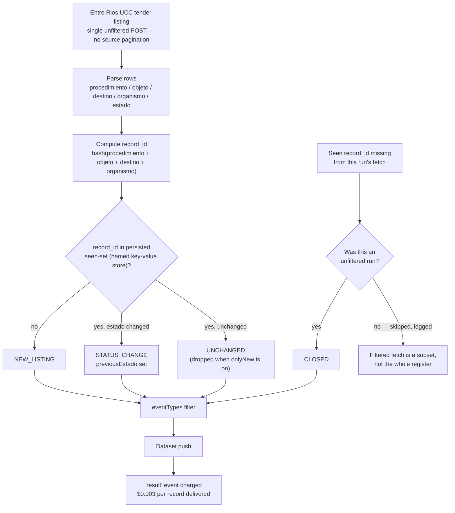

<div align="center">

# Entre Rios Argentina Licitaciones - Tender Delta API

**A scheduled delta monitor for the Province of Entre Rios' public tender register — new listings, status changes, and closures, without a manual re-read of a government listing page.**

[](https://apify.com)
[](#pricing-pay-per-event)
[](https://www.typescriptlang.org/)
[](https://www.apache.org/licenses/LICENSE-2.0)

[](https://apify.com/stefano_seggio/entrerios-compras-monitor)

Owner reference: [console.apify.com/actors/oiXeFzZGlIQ6mKgoo](https://console.apify.com/actors/oiXeFzZGlIQ6mKgoo)

</div>

---

## What this actor monitors

Entre Rios, Argentina publishes its entire public procurement register — the Unidad Central de Contrataciones' backlog of licitaciones, solicitudes de cotizacion, and contrataciones directas — as a single listing page with no API, no RSS feed, and no official change log of its own. Anyone tracking Entre Rios government tenders and public procurement today — a supplier bidding into a specific organismo, a compliance or gestor team following several accounts, a researcher mapping provincial contracting activity — has to open that page by hand, re-apply filters, and re-read rows already seen before, across a register that goes back to at least 2004 and currently holds 5,505 verified live records.

**entrerios-compras-monitor** turns that manual re-read into one scheduled Apify run. It fetches the entire live register in a single pass, then, on every subsequent scheduled run, diffs the fresh fetch against its own persisted memory of every tender it has already seen. The dataset it produces contains only what genuinely changed: tenders that are brand new, tenders whose `estado` moved from "Proxima Apertura" to "Realizada" or "Fracasada," and tenders that quietly dropped out of the register altogether. Run unfiltered, it also works as a straight bulk export of the whole Entre Rios public procurement backlog, structured by the only fields this source actually discloses — `organismo`, `estado`, and `tipoLicitacion` (it publishes no contract value anywhere).

### Use cases

- **Bid-status tracking for a specific organism.** Set `organismo` to `"8"` (Ministerio de Salud) or any of the other seven issuing bodies and watch `estado` move through the pipeline, instead of re-opening the province's listing page by hand.
- **Delta monitoring for bid consultants and gestores.** Schedule a run with `onlyNew: true` so each run's dataset holds only the tenders that are genuinely new, status-changed, or closed since the previous run.
- **Procurement-pattern research.** Pull the full unfiltered backlog and cross `organismo`, `estado`, and `tipoLicitacion` to see which provincial bodies run the most contracting processes and how often they complete versus fail.

## How it works



## Features

| Feature | Detail |
| --- | --- |
| Full-backlog extraction | One run fetches the entire live Entre Rios tender register — 5,505 records verified live, back to at least 2004 — in a single request; the source has no native pagination. |
| Delta mode (`onlyNew`) | Cross-run identity is persisted in a named key-value store scoped to this actor, so a scheduled run pushes only tenders that are new, status-changed, or closed since the last run. |
| `STATUS_CHANGE` detection | Free to detect since `estado` is already in every fetched row; ships with `previousEstado` set to the status the tender was last seen under. |
| `CLOSED` detection, correctness-gated | Only computed on a fully unfiltered run, because a filtered fetch is a subset of the register — live testing caught an ungated version wrongly flagging 37 unrelated records as closed on a filtered follow-up run. |
| Structured filters | `estado`, `tipoLicitacion`, `organismo`, `anio`, and a server-side `palabra` keyword filter matching the source's own search form. |
| Configurable event delivery | `eventTypes` narrows delta-mode output to any subset of `NEW_LISTING` / `STATUS_CHANGE` / `CLOSED`. |
| Retry with backoff | Every request goes through a shared retry helper — up to 4 retries (5 attempts total), starting at a 1-second delay and doubling — on network errors and any non-2xx response. |
| Two dataset views | "Overview" (listing-style fields) and "Status changes & closures" (`record_id`, `event_type`, `previousEstado`, `estado`, `organismo`, `objeto`, `scraped_at`). |

## Quick start

Run it from the Apify CLI with this actor's own documented example input — tracking Ministerio de Salud (`organismo: "8"`) in delta mode, delivering only new listings and status changes:

```bash
apify call entrerios-compras-monitor --input '{
  "estado": "",
  "tipoLicitacion": "",
  "organismo": "8",
  "anio": "",
  "palabra": "",
  "maxItems": 6000,
  "onlyNew": true,
  "eventTypes": ["NEW_LISTING", "STATUS_CHANGE"],
  "dateRange": ""
}'
```

Leave every filter blank (`""`) to pull every organismo, estado, and tipoLicitacion in one unfiltered run — the only mode that also unlocks `CLOSED` detection. Programmatic equivalents in Node.js and Python, using the official `apify-client` packages, are included in this repo (`run-monitor.js`, `run_monitor.py`).

### Input reference

| Field | Type | Default | Description |
| --- | --- | --- | --- |
| `estado` | string (enum) | `""` | Process status: `""` all, `"1"` Proxima Apertura, `"2"` En proceso de Evaluacion, `"3"` Realizada, `"4"` Fracasada. |
| `tipoLicitacion` | string (enum) | `""` | Procedure type: `""` all, `"1"` Licitacion Privada, `"2"` Licitacion Publica, `"3"` Solicitud de Cotizacion, `"4"` Contratacion Directa. |
| `organismo` | string (enum) | `""` | Issuing organism — 8 values including Ministerio de Salud, UADER, Direccion Provincial de Vialidad, and Unidad Central de Contrataciones. |
| `anio` | string | `""` | Filter by year, e.g. `"2025"`. Data goes back to at least 2004. |
| `palabra` | string | `""` | Free-text keyword filter, matched server-side the same way the site's own "Palabra" search box works. |
| `maxItems` | integer | `1000` | Hard cap on tenders returned this run; the full unfiltered backlog is over 5,000 rows. |
| `onlyNew` | boolean | `false` | Delta mode: return only tenders that are new, status-changed, or closed since a prior run. Does not reduce fetch volume — only what gets pushed to the dataset. |
| `eventTypes` | array (enum) | all three | Which delta events to deliver when `onlyNew` is on: `NEW_LISTING`, `STATUS_CHANGE`, `CLOSED`. |
| `dateRange` | string (enum) | `""` | Present for input-shape consistency with this developer's other monitor actors; has no effect on this source (see Known limitations). |

### Output example

```json
{
  "record_id": "a1e4f9c2d7b6803e5f18c4a9b2d6e701",
  "procedimiento": "Solicitud De Cotizacion 54/2025",
  "anioProcedimiento": "2025",
  "objeto": "Adquisicion de insumos descartables para centros de salud del interior provincial",
  "destino": "Direccion de Suministros - Ministerio de Salud",
  "organismo": "Ministerio de Salud",
  "estado": "Realizada",
  "event_type": "STATUS_CHANGE",
  "previousEstado": "En proceso de Evaluacion",
  "scraped_at": "2026-09-08T09:15:42.118Z",
  "is_new": false,
  "source_url": "https://www.entrerios.gov.ar/contrataciones/licitaciones.php"
}
```

`record_id` is a stable hash of `procedimiento + objeto + destino + organismo` — the source has no native row id, and `estado` is deliberately excluded from the hash so the same procedure keeps its id across status changes.

## Instant Terminal Run (cURL)

Runs synchronously and returns the resulting dataset items directly in the response - no polling needed. Get your token from [console.apify.com/settings/integrations](https://console.apify.com/settings/integrations).

```bash
curl -X POST "https://api.apify.com/v2/acts/oiXeFzZGlIQ6mKgoo/run-sync-get-dataset-items?token=<YOUR_API_TOKEN>" \
  -H "Content-Type: application/json" \
  -d '{
  "maxItems": 50,
  "onlyNew": true
}'
```

## Sample Extracted Dataset (JSON)

One real record from this Actor's own dataset, matching `.actor/dataset_schema.json`:

```json
{
  "record_id": "a4f8c2e1b6d09573",
  "procedimiento": "Licitacion Publica N 22/2026",
  "anioProcedimiento": "2026",
  "objeto": "Provision de equipamiento informatico para escuelas rurales",
  "destino": "Consejo General de Educacion",
  "organismo": "Ministerio de Gobierno y Justicia",
  "estado": "En proceso",
  "event_type": "NEW_LISTING",
  "previousEstado": null,
  "scraped_at": "2026-09-15T14:07:02.000Z",
  "is_new": true,
  "source_url": "https://www.entrerios.gov.ar/compras/"
}
```

## Pricing (Pay-Per-Event)

| Event | Price | Charged when |
| --- | --- | --- |
| `result` | $0.003 per event | Once for every tender record delivered into the dataset. |

Delta mode is what keeps a recurring monitor affordable: with `onlyNew: true`, an unchanged tender is filtered out before it is ever pushed to the dataset, so a scheduled run is billed only for records that are actually new, status-changed, or closed — never for re-confirming a tender nothing happened to.

## Why not just scrape it yourself

- **Zero infrastructure.** No server, container, or cron box to keep alive just to poll one government listing page on a schedule.
- **Managed scheduling.** Apify's own scheduler runs this at whatever cadence you set, with run history and logs already attached — no separate scheduler process to babysit.
- **No proxy or session babysitting.** The actor handles its own request retries (exponential backoff, non-2xx handling) against the source directly, with no session state or proxy pool of your own to maintain for a source this size.
- **Delta detection is already solved, including its edge cases.** Correctly telling "new" from "status-changed" from "closed" — and specifically *not* over-flagging closures on a filtered fetch — took a real production bug (37 false-positive closures) to get right; that correctness gate ships built in rather than something you'd have to rediscover.

## Known limitations

- **No source pagination.** A single request returns the entire backlog every time, so `onlyNew` changes only which records get *delivered* to the dataset, not how much is fetched from the source.
- **`dateRange` has no effect on this source.** Entre Rios' tender listing publishes no per-record date field anywhere — not on the listing, not on any detail page, because no detail page exists. The field is kept only for input-shape consistency with this developer's other monitor actors; setting it logs a warning instead of silently misfiltering.
- **No true `UPDATED` event.** `record_id` deliberately excludes `estado` so a status change keeps the same id, but a change to `procedimiento`, `objeto`, `destino`, or `organismo` is indistinguishable from a new listing, since the source issues no native row id to correlate old and new text against. Only `estado` changes are ever reported as `STATUS_CHANGE`.
- **`CLOSED` is unfiltered-only.** It runs only when `estado`, `tipoLicitacion`, `organismo`, `anio`, and `palabra` are all left blank; on any filtered run it is skipped (and logged) rather than risk false positives.

## Reliability & data integrity

Cross-run identity is not held in ephemeral per-run storage — it lives in a named key-value store dedicated to this actor, which survives between scheduled runs. Each seen `record_id` is stored together with the `estado` it was last observed under, capped at the 10,000 most-recently-confirmed ids, comfortably above the current ~5,505-row backlog. Every outbound request goes through a shared retry helper with exponential backoff (up to 4 retries, 5 attempts total, starting at 1 second and doubling) on both network-level errors and any non-2xx HTTP response, so a transient failure on the province's own server doesn't silently drop a run.

## Support

This actor is built and maintained by an independent developer, not a staffed vendor team — there is no dedicated support desk or contractual uptime SLA on offer. Questions, bugs, or source-coverage requests go through the Apify Store's Issues tab and are typically addressed within about 48 hours.

---

<div align="center">

Part of **Delta Registry** — pay-per-event regulatory & compliance data infrastructure for public records that publish no API, no feed, and no change log of their own. For professional inquiries or enterprise licensing, reach out on [LinkedIn](https://www.linkedin.com/in/stefanoseggio-deltaregistry); for the rest of the fleet, see [github.com/stefanoseggio](https://github.com/stefanoseggio).

</div>
